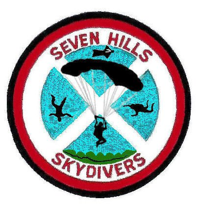

## The Seven Hills Difference

We at Seven Hills take an active interest in each and every one of our students' __safety__ and __learning__. You will quickly become a part of our Seven Hills family as you enter what may be _the greatest sport in the world_.

## More about us

Since 1962, Seven Hills Skydivers has been jumping out of airplanes. We are a __not-for-profit__, all __volunteer__, __member owned and operated__ club only __15 minutes outside of Madison__. We're here to promote skydiving and introduce people to the sport by training students and performing demo jumps. __Safety is our main priority__ and our record is second to none!

Seven Hills is much more than skydiving - at Seven Hills, you're part of our sky family. Any licensed skydiver has the opportunity to become a Seven Hills member and to __make a real impact on the club__ by voting on club business and volunteering. All of our members are passionate about skydiving and volunteer their time to share the excitement of skydiving with others.

Being a nonprofit organization lets us put __safety above all else__. We are a __group member__ of the [United States Parachute Association](https://uspa.org/) (USPA), and _all_ instructors and coaches at Seven Hills have current USPA ratings and are certified for Instructor Assisted Deployment and Tandem skydiving. Seven Hills' instructional staff includes skydivers in the sport for __decades__ with __thousands__ of skydives and holding __world records__. We also use __state-of-the-art__, modern [Aerodyne](https://www.flyaerodyne.com/icons/icon-student/) and [United Parachute Technologies](http://www.uptvector.com/) containers.

Just as well, many of our instructors started as students here. It's up to you how far you want your skydiving career to go, and whether one jump or 10,000, we can help you achieve your goals.

_There is absolutely nothing like the feeling you get when you make your first skydive!_ Skydiving at 7 Hills in Madison, Wisconsin is more than jumping out of an airplane. _It's stepping out into a different world_, a world where you can actually __FLY__! Cars and houses disappear, and plots of land make a giant checkerboard on the earth below, like a vast oil painting. Try it once and you will never be the same! Whenever you look skyward, you'll want to be up there. Come jump with the skydivers that do it for the love of the sport! __Go for it!__ We look forward to seeing you at Seven Hills - blue skies! 😁

## Testimonials

 * _Absolutely loved the experience and was happier than ever that my mother and I went to Seven Hills to skydive for the first time. The workers there were very understanding and explained everything in great detail. I would highly recommend going there to skydive. Also want to give a shoutout to Bad Andy for making my experience great! Thank you so much Seven Hills!_ __- Tiff Whitt__  
 * _My first skydiving experience was incredible! I am so filled with gratitude and bliss after this amazing experience! Everyone I encountered at Seven Hills were friendly, encouraging, and professional. The perfect balance of light-hearted and serious to help you feel at ease. 
My tandem instructor, Dewey, explained things so thoroughly, going over the procedures until he sensed I was comfortable and showed me all of the amazing safety features on the parachute. He was informative, professional, and the perfect balance of confidence. I had total trust in the experience! 
I would recommend Seven Hills Skydivers without reservation to anyone!_ __- Fearn Rebecca__  
 * _I can't say enough about the Seven Hills crew. I've been to their Head to the Hills event for a few years now and am never disappointed. This year they hosted a special event for veterans and I was grateful to be able to witness the tandem jumpers reactions. 
This is an amazing place for your first jump, or just to spectate. It's a family atmosphere and they will treat you like family.
And after you make that first jump...you ARE family!!_ __- Missy School-Keough__  
 * _Something I've always wanted to do and it was a great experience at Seven Hills! Everything was explained very thoroughly, so I knew what to expect every step of the way. Beautiful view! Everyone was very friendly and fun to be around! This is definitely the place to go!_ __- Donna Bucalo Cox__  
 * _Extremely happy we chose Seven Hills for our first skydive! Couldn't have found a better group of guys to work with! They were professional, fun, and made sure that we felt both safe and comfortable the entire time. Definitely, a five star experience from start to end!_ __- Amanda Lillie__

 

