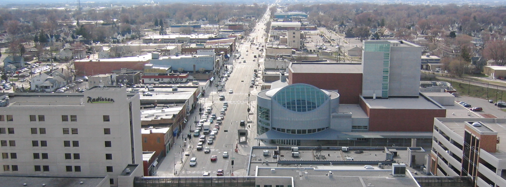

## Skydiving in Appleton, WI

Seven Hills is Appleton's __closest skydiving center__. We're only one and a half hours away from Appleton. A simple, quick drive down on I-41 and US-151 for all Appletonians!

## Why jump with Seven Hills Skydivers

Seven Hills Skydivers is a nonprofit, volunteer owned and operated skydiving center located Northeast of Madison, WI in business for __more than 60 years__. We have highly qualified [instructors and coaches](../../who-we-are), and have safety record second to none. To learn more about us, [click here](../../about-us).

If you're interested in [making a Tandem skydive](../../tandem) or [going solo](../../instructor-aided-deployment), we have the expertise to provide a safe, fun experience that you will never forget.

You can book your skydive anytime - just [click here to get started](../../book-now)! See you soon - blue skies! 😄

	<a href="../../book-now" class="button button--primary">Book your skydive now <i class="fa fa-angle-double-right"></i></a>

## Directions to Seven Hills Skydivers from Appleton, WI

 * Get on I-41/US-41 S in Grand Chute (2.9 mi)
 * Follow I-41/US-41 S to County Hwy N/WI-26 S/WI-26 Trunk S in Oshkosh. Take exit 113 from I-41/US-41 S (23.2 mi)
 * Get on US-151 S/WI-26 S in Waupun (21.9 mi)
 * Follow US-151 S to WI-73 S in Columbus. Take exit 115 from US-151 S (32.4 mi)
 * Turn right onto WI-73 S, destination will be on the left 🏁

<iframe src="https://www.google.com/maps/embed?pb=!1m28!1m12!1m3!1d671817.399303058!2d-89.23276359327329!3d43.555054601441206!2m3!1f0!2f0!3f0!3m2!1i1024!2i768!4f13.1!4m13!3e6!4m5!1s0x8803b682b903f6c9%3A0x9ca1d6a50675935b!2sappleton!3m2!1d44.261930899999996!2d-88.41538469999999!4m5!1s0x88068c905a73806f%3A0x23161a6f3ddc1fe9!2sSkydive+Madison-+Seven+Hills+Skydivers+Inc%2C+7530+WI-73%2C+Marshall%2C+WI+53559!3m2!1d43.260821!2d-89.067792!5e0!3m2!1sen!2sus!4v1518813177535" width="100%" height="450" frameborder="0" style="border:0" allowfullscreen></iframe>