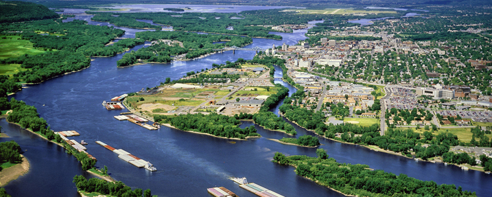

## Skydiving close to La Crosse, WI

Hello, La Crosse! Seven Hills is __one of the closest options__ for you.  Unfortunately, it's still a bit of drive.

We're 2 hours and 20 minutes East of La Crosse. However, once you do a skydive at Seven Hills, the drive will be __totally worth it__! After all, some of our regulars come further every weekend to enjoy the wonderful skydiving environment that Seven Hills has to offer.

## Why jump with Seven Hills Skydivers

At Seven Hills, we have very talented, __world-record holding__ instructors with __decades of experience__. Seven Hills is a __nonprofit__, volunteer owned and operated dropzone that's been around for over __55 years__! Our instructors are here because they're passionate about skydiving and want to share the sport with you.

At Seven Hills, we offer __two methods__ for your first skydive. The first method, [a tandem skydive](../../tandem-skydiving-wisconsin) is an excellent option for those that want their skydive instructor to be in control during the skydive.

For those that want to enjoy skydiving by themself or want to work towards [earning their skydive "A" license](../../learn-to-skydiver), we offer [solo skydiving](../../solo-skydiving-wisconsin).

__Either option is a great choice__ - it really depends on you! Feel free to [contact us](../../contact-us) if you have any questions, and we hope to see you soon!

	<a href="../../book-now" class="button button--primary">Book your skydive now <i class="fa fa-angle-double-right"></i></a>

## Directions to Seven Hills Skydivers from La Crosse, WI

 * Get on I-90 E
 * Take exit 126
 * Turn left onto W North St
 * Go straight through the 3 traffic circles, turning into WI-V
 * Continue for ~13.5 miles, following WI-V's twists and turns
 * Turn left onto WI-73 (stop sign)
 * Seven Hills is down the road half a mile on the left! 🏁

<iframe src="https://www.google.com/maps/embed?pb=!1m28!1m12!1m3!1d1479052.7681412406!2d-91.25982060331698!3d43.61122749648407!2m3!1f0!2f0!3f0!3m2!1i1024!2i768!4f13.1!4m13!3e6!4m5!1s0x87f954df6732b395%3A0x7fa98815193722b0!2sLa+Crosse%2C+WI!3m2!1d43.8013556!2d-91.23958069999999!4m5!1s0x88068c905a73806f%3A0x23161a6f3ddc1fe9!2sSkydive+Madison-+Seven+Hills+Skydivers+Inc%2C+7530+WI-73%2C+Marshall%2C+WI+53559!3m2!1d43.260821!2d-89.067792!5e0!3m2!1sen!2sus!4v1518891405998" width="100%" height="450" frameborder="0" style="border:0" allowfullscreen></iframe>
