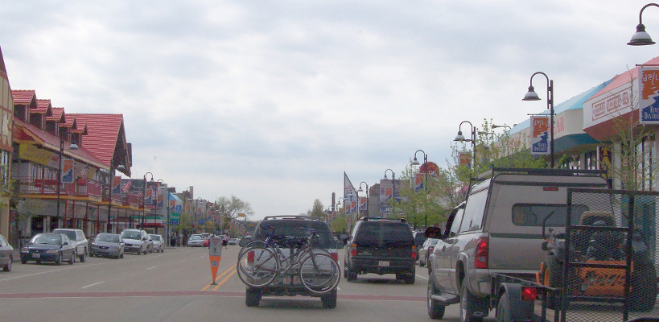

## Skydiving close to the Wisconsin Dells

Located only __an hour away__ from the Wisconsin Dells, Seven Hills Skydivers is only a short trip in the car. While your family enjoys the various activities in the Dells, __why not add skydiving to the fun?__ Seven Hills has facilities for those in your group not jumping to relax, enjoy the outdoors in the country, and watch landings. We also have __refreshments__ available and __air conditioned__ rooms to take a break from the summer heat.

You might also be wondering, "why should I jump with Seven Hills?" Apart from being the __closest skydiving center__ to the Wisconsin Dells, we offer __extremely qualified__ and experienced instructors for the __utmost safety__. We're a nonprofit, volunteer owned and operated club, and we've [been in business](../../about-us) for more than __55 years__. We're a very family oriented dropzone with a easy going atmosphere. We will make your skydive a safe, fun, exciting experience &mdash; one you will not forget.

If you're on vacation and only have time for a quick afternoon or morning visit (or are bringing members of your family to watch), we recommend a [tandem skydive](../../tandem-skydiving-wisconsin). However, we also offer the thrill of [solo skydiving](../../solo-skydiving-wisconsin) (taking a whole day) if that's more your style.

	<a href="../../book-now" class="button button--primary">Book your skydive now <i class="fa fa-angle-double-right"></i></a>

## Directions to Seven Hills Skydivers from the Wisconsin Dells

 * Take WI-16 E
 * Turn right to merge onto I-39 South towards WI-78/I-90/Merrimac
 * Use the right 2 lanes to merge onto I-39 S towards Madison
 * Take exit 126 for Wisconsin V towards Dane/De Forest
 * Follow I-90 E/I-39 S
 * Take exit 126
 * Turn left onto W North St
 * Continue straight through the 3 traffic circles
 * Follow Wisconsin V through it's many twists and turns
 * Turn right onto Wisconsin 73 after ~13.5 miles
 * Seven Hills is on the left half a mile down the road! 🏁

<iframe src="https://www.google.com/maps/embed?pb=!1m28!1m12!1m3!1d371173.68778712366!2d-89.68417213773672!3d43.38132209767436!2m3!1f0!2f0!3f0!3m2!1i1024!2i768!4f13.1!4m13!3e6!4m5!1s0x8807493e07cb769d%3A0x4acd26cd280b3378!2sWisconsin+Dells%2C+Wisconsin!3m2!1d43.6274794!2d-89.7709579!4m5!1s0x88068c905a73806f%3A0x23161a6f3ddc1fe9!2sSkydive+Madison-+Seven+Hills+Skydivers+Inc%2C+7530+WI-73%2C+Marshall%2C+WI+53559!3m2!1d43.260821!2d-89.067792!5e0!3m2!1sen!2sus!4v1518814304404" width="100%" height="500" frameborder="0" style="border:0" allowfullscreen></iframe>
