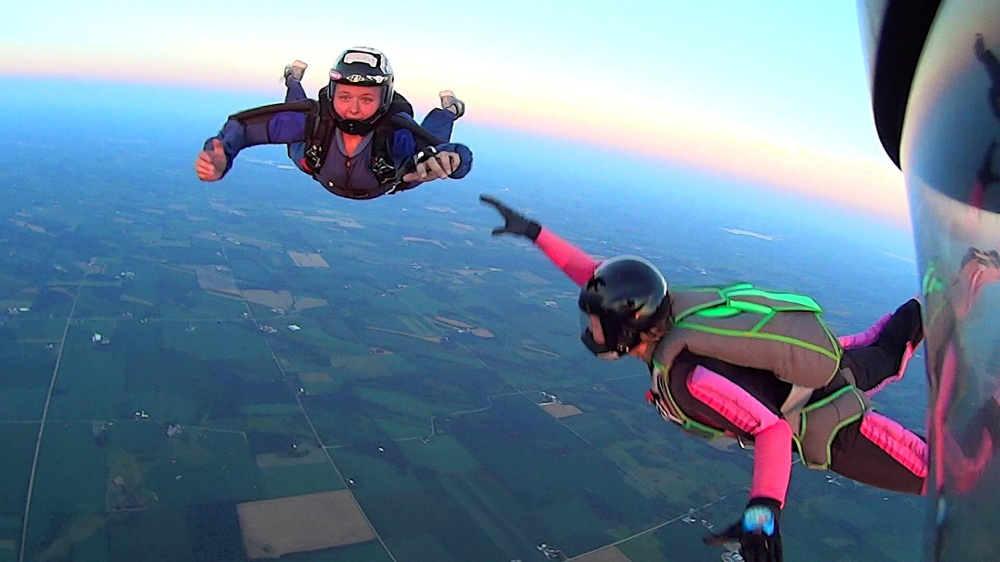
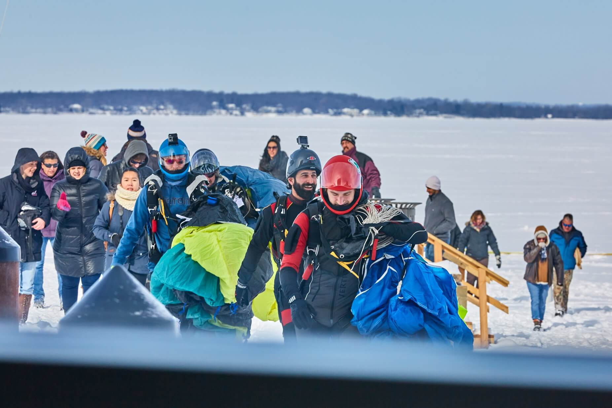
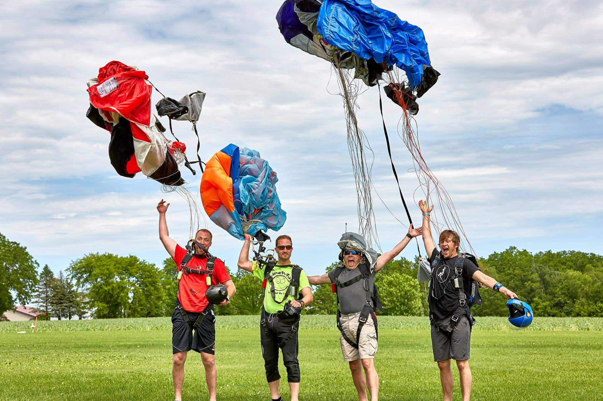

## Experienced jumpers 😎

As a nonprofit, volunteer dropzone, experienced jumpers are the lifeblood of Seven Hills! We welcome jumpers to come out to jump, socialize, and have fun.

Read more about [our facilities](../our-facilities) to see more of what we offer.

See you in the air up there!

## Our Safety and Training Advisors

The two people below are our awesome Safety and Training advisors. Most weekends, you can find one (or both) of them at the dropzone. __Please don't hesistate__ to talk with them if you have any questions or concerns.

<ul class="people">
	<li class="people__item">
		
		
Andy Van Handel

	</li>
	<li class="people__item">
		
		
Russ Haas

	</li>
</ul>

## Stay in the loop

Weather updates, information, and pictures are all shared on our Facebook group, [Friends of Seven Hills Skydivers](https://www.facebook.com/groups/382109661883081/). Please join to stay in up to date with the latest shenanigans happening at Seven Hills!

## Our pricing

You can find our experienced jump prices [here](../prices).

  

  

  

  

