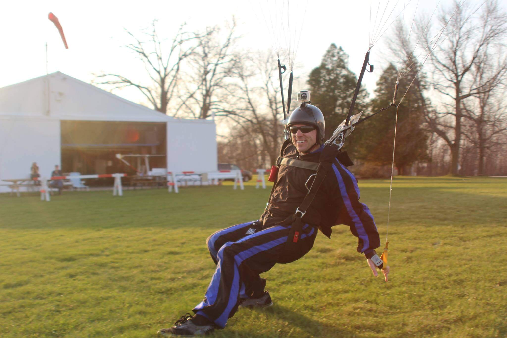

## Experienced jumpers 😎

As a nonprofit, volunteer dropzone, experienced jumpers are the lifeblood of Seven Hills! We welcome jumpers to come for a day or every weekend!

Read more about [our facilities](../our-facilities) to see more of what we offer.

## Stay in the loop

Weather updates, information, and pictures are all shared on our Facebook group, [Friends of Seven Hills Skydivers](https://www.facebook.com/groups/382109661883081/). Please join to stay in up to date with the latest shenanigans happening at Seven Hills!

## Our pricing

You can find experienced jump prices [here](../prices).

  

  

  

  

