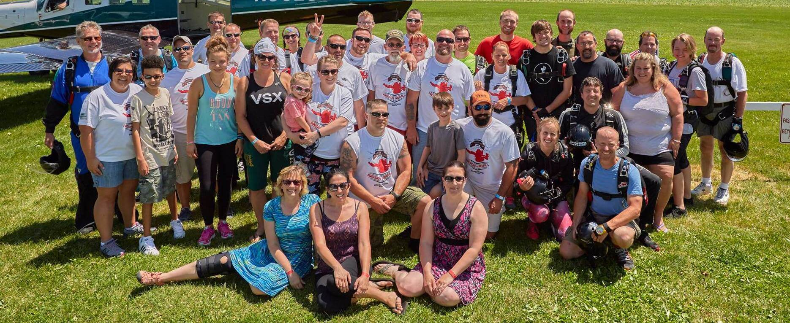

Select your skydive

  

    <a href="instructor-assisted-deployment">
      
Solo

    </a>
    <aside>Get training and skydive by yourself from 4,000 feet!</aside>
  

  

    <a href="tandem">
      
Tandem

    </a>
    <aside>Skydive with an instructor from 10,000 feet!</aside>
  

  <h2>Solo Skydive $125 Spring Special!</h2>

  Your chance to take your solo skydive at the __lowest price of the year!__ Book now to take the class in __April__ or __May__ to get this great price. Call (608) 244 - 5252 to sign up! Subject to availability, classes fill up quickly.
    
  [Click here to learn more](../instructor-assisted-deployment)

### 2018 Head to the Hills Boogie

Seven Hills Skydivers of Madison, WI is excited to once again host the Head to the Hills Boogie in 2018! Whether it is your first skydive or your thousandth, join us for a weekend of skydiving and fun.

[Click here to learn more about this exciting event!](posts/head-to-the-hills-2018)

### New jumper?

We offer two training methods, and one is not necessarily better than the other. Which method you decide on depends more on your motivation, and what you’re interested in getting out of your skydiving experience.

The **Tandem** method is popular today, but if you’re interested in 'doing by yourself' or pursuing your skydiving license you will need to take our **Instructor Assisted Deployment** (IAD) first jump course. The decision is like, do you want to take a ride in a car or drive it. Read through the [Tandem](../tandem) and [IAD](../instructor-assisted-deployment) pages for a detailed description of the two training options.

