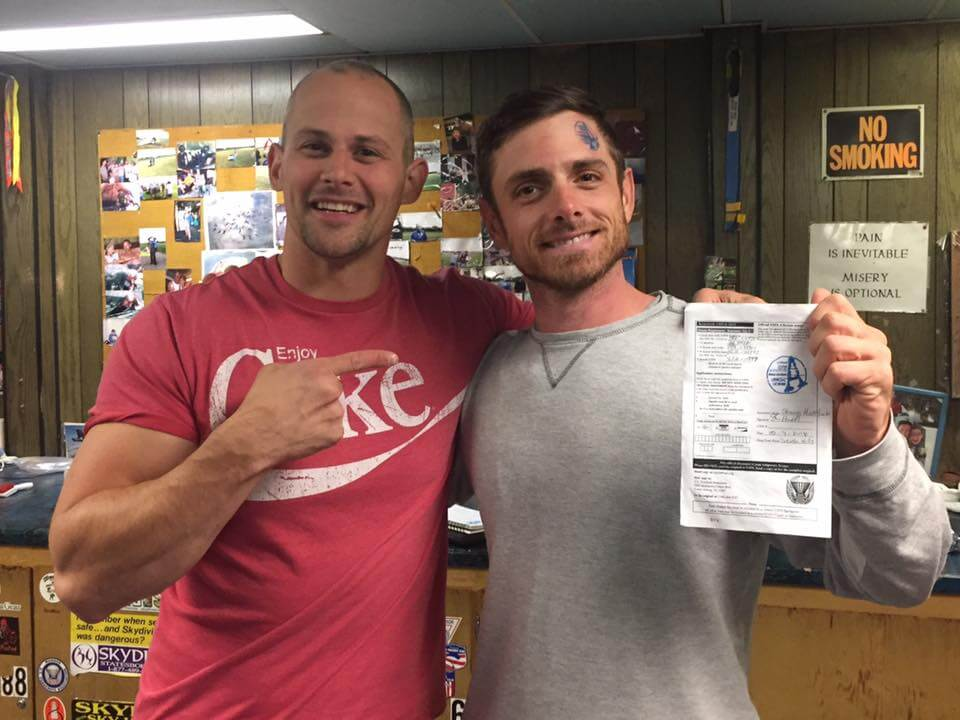
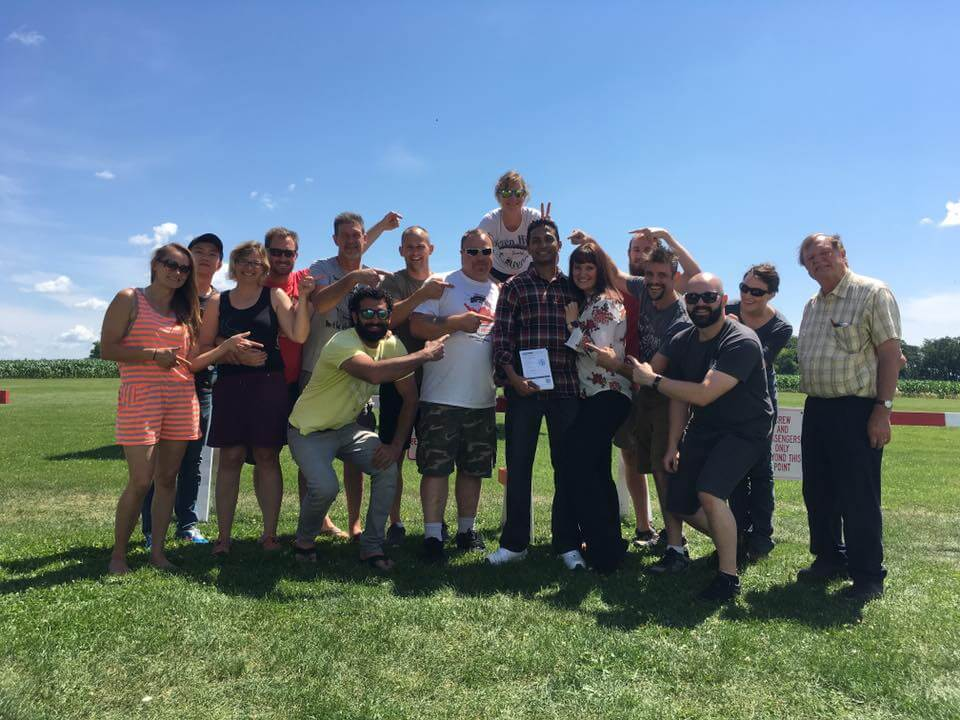
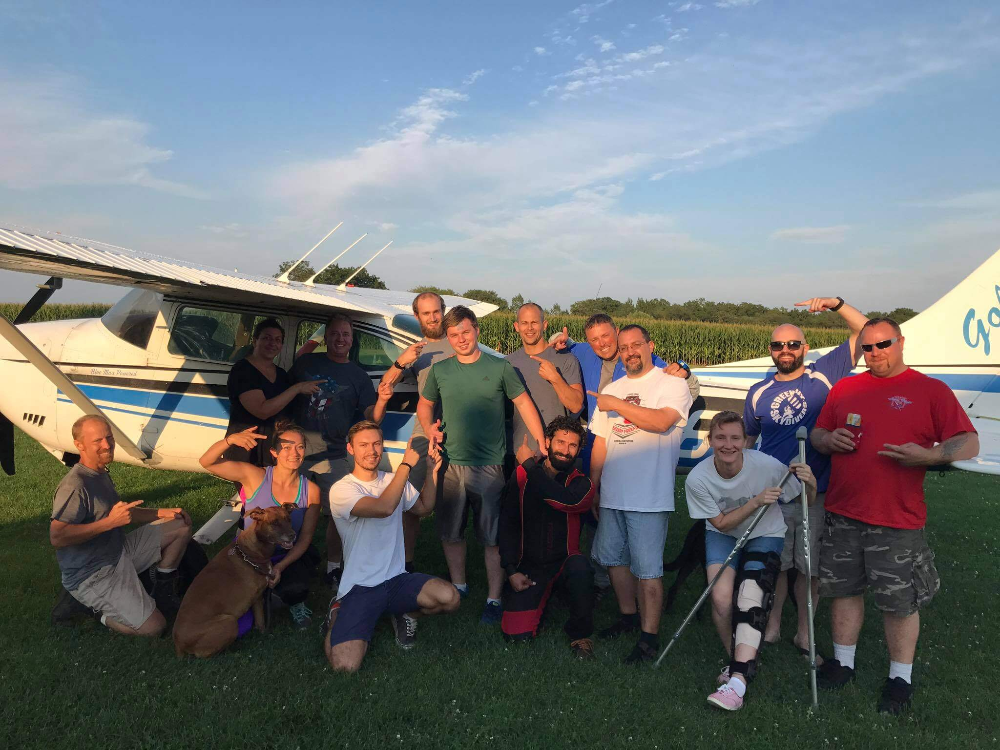

## Learn to skydive &mdash; become a licensed skydiver! 💥

Skydiving can be a life-changing event, and it gets even better when you become a licensed skydiver! Are you up to the challenge? _Do you have what it takes?_  We offer a __comprehensive__, __affordable__ student program to obtain your A-License. An A-License will grant you the freedom to jump _anywhere in the world!_ 🌎

During your training, you will quickly become a part of our skydive family in an open, friendly, and approachable environment where __safety is the highest priority__. You will work with instructors and coaches __one-on-one with training tailored to you__.

Our [highly qualified instructors and coaches](../../who-we-are) will equip you with state-of-the-art, comfortable, and safe [Aerodyne](https://www.flyaerodyne.com/icons/icon-student/) containers and [Performance Designs](http://www.performancedesigns.com/products/navigator/) canopies, leading manufacturers in the industry.

It might not be easy, __but the journey will be worth it__.

  

## The IAD Student Program

We follow the [IAD student progression](../solo-skydiving-wisconsin) for training students (at Seven Hills, it's also called the ["solo" progression](../solo-skydiving-wisconsin)). This is an "ease you into it" type of progression, meaning you start at lower altitudes while you practice deploying your parachute. Once you demonstrate that you can deploy your own parachute safely, then we work our way up to __10,000 feet__ where you will learn freefall maneuvers such as __turns__, __flips__, __barrel-rolls__, and __formation skydiving__.

## The Jumps

Below is a summary of the skydives you can expect on your way to earning your "A" license. We have a page [detailing the rates you can expect](../solo-rates).

 * __2 IAD deployments__ where you focus on good body position and control (your first IAD jump counts for one of these!)
 * At least __3 practice pilot chute throws__ (PPCTs). PPCTs build your muscle memory for deploying a parachute safely
 * __1 clear and pull__ - deploy your parachute yourself without any instructor help!
 * __2 10 second freefalls__ - experience your first extended freefall as you work on maintaining a heading in freefall and demonstrate a safe deployment
 * __2 15 second freefalls__ - from here on out you will jump with a coach next to you in freefall while you work on turns and other freefall maneuvers
 * __2 30 second freefalls__ - continue freefall maneuvers
 * __All the way up!__ You will conduct the rest of your jumps from __10,000 feet__ - a __45 second freefall__! You will work on freefall maneuvers until you demonstrate that you can move around safely in freefall.
 * __Check Dive!__ After you complete at least __25__ skydives demonstrating many different freefall and parachute maneuvers an instructor will take you up on your final dive as a student. Perform a timed sequence of flips, barrel rolls, docking, and tracking and earn your A-License!

## Take your first jump

It seems like a lot - but don't worry! We will walk you through each jump, starting at #1, __at your own pace__. If you're interested in becoming a licensed skydiver and are interested in your first solo skydive, check out the first jump page [here](../solo-skydiving-wisconsin). You can also call us with any questions at <a href="tel:6082445252">(608) 244 - 5252</a>.

## Beyond the A-license

Once you become an A-licensed skydiver, you have the opportunity to jump almost anywhere. However, we will continue to work with you to refine your skills, earn more advanced licenses (B, C, and D), enter skydiving specialties (like wingsuiting, freeflying, etc) and help you throughout your skydiving career.

Below are a few pictures of students that have received their "A" license recently!

  

  

  

  

  

