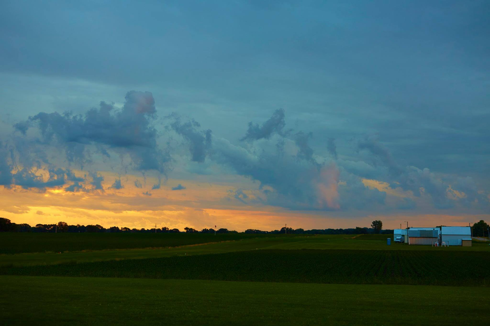

## Our Location

7530 State Highway 73 
York Center, WI

<iframe src="https://www.google.com/maps/embed?pb=!1m14!1m8!1m3!1d374279.5091384703!2d-89.4506881!3d42.8716059!3m2!1i1024!2i768!4f13.1!3m3!1m2!1s0x88068c905a73806f%3A0x23161a6f3ddc1fe9!2sSkydive+Madison-+Seven+Hills+Skydivers+Inc!5e0!3m2!1sen!2sus!4v1518891262921" width="100%" height="450" frameborder="0" style="border:0" allowfullscreen></iframe>

## From Madison, WI

We're the closest dropzone to Madison, and by far the easiest to drive to (almost all highway driving).

Simply get on __East Washington__ going away from the Capitol, continue as it turns into US-151, get off at __exit 111__ and __turn right__ onto Highway V, continue ~2 miles and __turn right again__ onto Highway 73 (the first stop sign). We're on the left half a mile down the road!

## From other cities

We're the __top skydive center__ for many other cities, as well! Check out the below links for how to get to Seven Hills Skydivers from your city.

 * [Directions from Appleton, WI](../city/skydiving-appleton-wi)
 * [Directions from Janesville, WI](../city/skydiving-janesville-wi)
 * [Directions from La Crosse, WI](../city/skydiving-la-crosse-wi)
 * [Directions from Milwaukee](../city/skydiving-milwaukee)
 * [Directions from Wisconsin Dells](../city/skydiving-wisconsin-dells)

 

