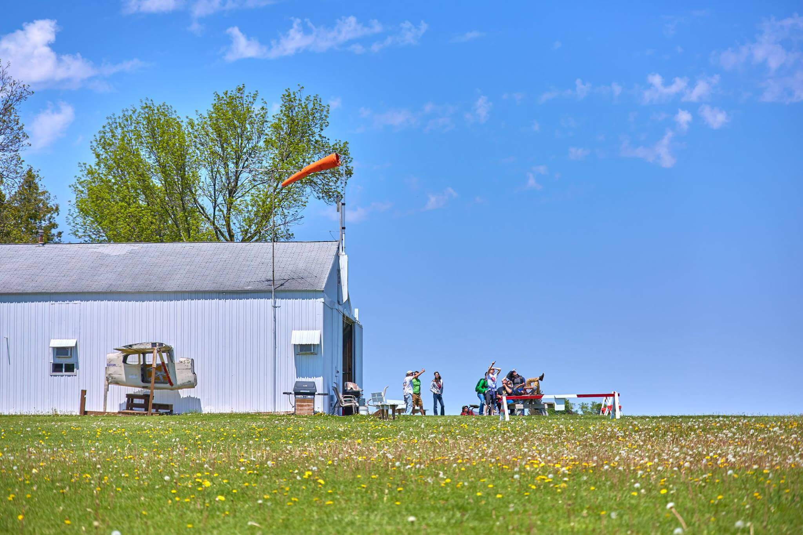
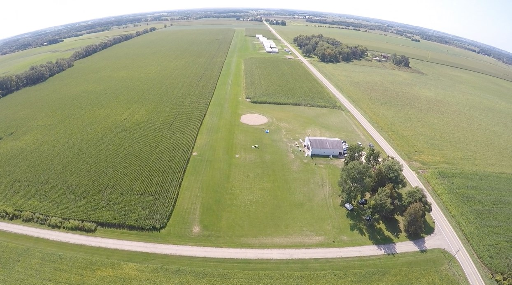
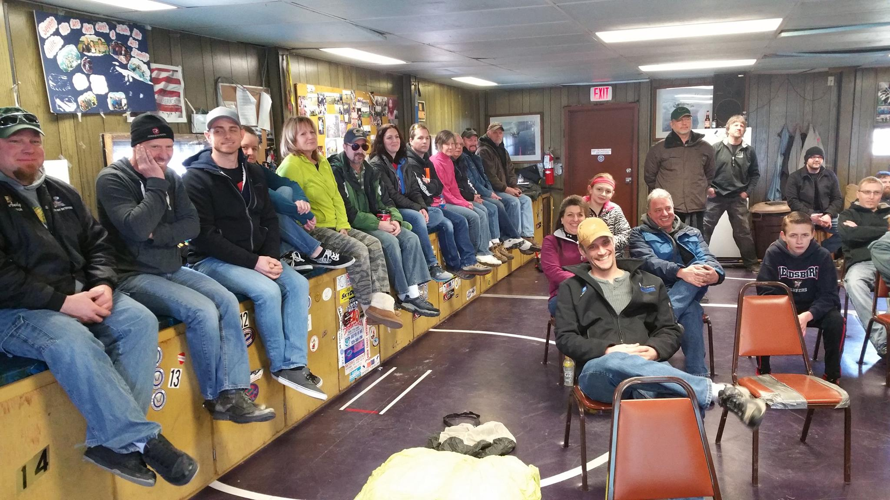

## Our Facilities

Seven Hills Skydivers of Madison, WI is a small, friendly, member-owned and operatored club with a great atmosphere. Located on a __private grass airstrip__ ([Mathaire airfield - WI97](http://www.airnav.com/airport/WI97)). We have a large clubhouse with __air-conditioned__ classrooms, TV/DVD, a hanger, full kitchen with stove, microwave, pizza oven, refrigerators, refreshments available for purchase, multiple restrooms, __free camping and showers__, RV electric hookups, fire pit (for after jumping), lots of free parking, patio and picnic areas.

For the skydiver, we have low rates, indoor (heated and air-conditioned) packing, video rooms, creeping area, gear sales/rental, complimentary rubber bands (crazy, right? 😂), accuracy pea gravel pit, riggers, instructors and coaches available. __Two Cessna 182 planes__, both with upgraded engines, are maintained and operated by FAA-certified commercial pilots and mechanics. Open weekends.

Experienced jumpers and spectators are welcome!

We do RW, CRW, VRW, and wingsuiting!

  

  

  

