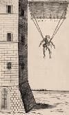
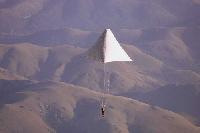
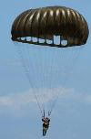
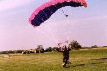

## A brief history of skydiving

<figure class="figure figure--float-left"><figcaption>Faust's parachute</figcaption></figure>Parachuting or skydiving has an interesting history that can take up a whole volume, but this article will attempt to give a brief synopsis of that history. Most people consider skydiving a product of the twentieth century, but its history actually goes way further back than that.
A parachute is a device used to slow the motion of an object through an atmosphere by creating drag. Parachutes are normally used to slow the descent of a person or object to Earth or another [celestial body](https://en.wikipedia.org/wiki/Celestial_body) within an [atmosphere](https://en.wikipedia.org/wiki/Celestial_body_atmosphere). [Drogue parachutes](https://en.wikipedia.org/wiki/Drogue_parachute) are also sometimes used to aid horizontal deceleration of a vehicle (a [fixed-wing aircraft](https://en.wikipedia.org/wiki/Fixed-wing_aircraft), or a [drag racer](https://en.wikipedia.org/wiki/Drag_racing)), or to provide stability (tandem free-fall, or [space shuttle](https://en.wikipedia.org/wiki/Space_shuttle) after touchdown). The word "parachute" comes from a French word with a Latin root: "para", meaning "against" or "counter" in Latin, and "chute", the French word for "fall". Therefore "parachute" actually means "against the fall". Many modern parachutes are classified as semi-rigid wings, which are quite maneuverable, and can facilitate a controlled descent similar to that of a glider. But older style parachutes were little more than cloth and sticks. The design has changed considerably over the years from roughly cut shapes to aerodynamic ram parachutes. Parachutes were once made from silk but now they are almost always constructed from more durable woven nylon fabric, sometimes coated with silicone to improve performance and consistency over time.

When square (also called ram-air) parachutes were introduced, manufacturers switched to low-stretch materials like [Dacron](https://en.wikipedia.org/wiki/Dacron) or zero-stretch materials like [Spectra](https://en.wikipedia.org/wiki/Ultra-high-molecular-weight_polyethylene#Fiber), [Kevlar](https://en.wikipedia.org/wiki/Kevlar), [Vectran](https://en.wikipedia.org/wiki/Vectran) and high-modulus [aramids](https://en.wikipedia.org/wiki/Aramid).

In the [9th century](https://en.wikipedia.org/wiki/9th_century), an [Arab](https://en.wikipedia.org/wiki/Arab) [Muslim](https://en.wikipedia.org/wiki/Muslim) daredevil named Armen Firman jumped from a tower in [Córdoba](https://en.wikipedia.org/wiki/Córdoba%2C_Spain) using a loose cloak stiffened with wooden struts to arrest his fall with only minor injuries.

The Chinese attempted parachuting in the 10th century, a thousand years before we did. Of course, there were no airplanes, so the Chinese did what we would today call base diving; that is, they jumped off outcroppings or other formations using rigid parasols that would allow them to float from a height to the ground. 

<figure class="figure figure--float-right"><figcaption>da Vivci's parachute</figcaption></figure>A conical parachute appears for the first time in the 1470s in an anonymous Italian manuscript, slightly preceding [Leonardo da Vinci](https://en.wikipedia.org/wiki/Leonardo_da_Vinci)'s conical parachute designs. It was intended as an escape device to allow people to jump from burning buildings, but there is no evidence that it was actually ever used. Leonardo da Vinci sketched a parachute while he was living in Milan around 1480-1483: a pyramid-shaped canopy held open by a square wooden frame. 

The first successful test of a parachute was made in 1617 in [Venice](https://en.wikipedia.org/wiki/Venice) by the [Dalmatian](https://en.wikipedia.org/wiki/Dalmatia) inventor [Faust Vrančić](https://en.wikipedia.org/wiki/Faust_Vrančić) or Veranzio which he named Homo Volans (Flying Man). He floated into the history books as the first man to utilize a Maximum Drag Decelerator, more widely known as a parachute. Did Faust invent the device? No; Faust had based the design for his parachute on a drawing done by Da Vinci.

The modern parachute was invented in 1783 by [Louis-Sébastien Lenormand](https://en.wikipedia.org/wiki/Louis-Sébastien_Lenormand) in France. Lenormand also sketched it beforehand. Two years later, [Jean-Pierre Blanchard](https://en.wikipedia.org/wiki/Jean-Pierre_Blanchard) demonstrated it as a means of safely disembarking from a hot air balloon. While Blanchard's first parachute demonstrations were conducted with a dog as the passenger, he later had the opportunity to try it himself in 1793 when his hot air balloon ruptured and he used a parachute to escape.

Subsequent development of the parachute focused on it becoming more compact. While the early parachutes were made of linen stretched over a wooden frame, in the late 1790s, Blanchard began making parachutes from folded silk, taking advantage of silk's strength and light weight. In 1797, [André-Jacques Garnerin](https://en.wikipedia.org/wiki/André_Garnerin) made the first jump using such a parachute. Garnerin also invented the vented parachute, which improved the stability of the fall.

At the end of the 19th century, an intrepid woman, Kathie Paulus became famous for skydiving in Germany and is now famous for these feats and her demonstrated skills.

At San Francisco in 1885, [Thomas Scott Baldwin](https://en.wikipedia.org/wiki/Thomas_Scott_Baldwin) was the first person in the United States to descend from a balloon in a parachute.

In 1911 [Grant Morton](https://en.wikipedia.org/wiki/Grant_Morton) made the first parachute jump from an airplane, in a Wright Model B, at Venice Beach, CA. The pilot of the plane was [Phil Parmalee](https://en.wikipedia.org/wiki/Phil_Parmalee). Morton's parachute was of the 'throw-out' type whereas he held the chute in his arms as he left the aircraft. Also in 1911, [Gleb Kotelnikov](https://en.wikipedia.org/wiki/Gleb_Kotelnikov) invented the first knapsack parachute, later popularized by Paul Letterman and Kathchen Paulus.

On March 1, 1912, US Army Captain Albert Berry made the first parachute jump from a moving aircraft over Missouri using a 'pack' style chute. This is the style of chute that became en reg with the actual chute being stored or housed in a casing on the jumper's body. [Štefan Banič](https://en.wikipedia.org/wiki/Štefan_Banič) from Slovakia invented the first actively used parachute, patenting it in 1913. On June 21, 1913, [Georgia "Tiny" Broadwick](https://en.wikipedia.org/wiki/Tiny_Broadwick) became the first woman to parachute jump from a moving aircraft over Los Angles and to dive in free fall (in 1914).

## Military parachuting

<figure class="figure figure--float-left"><figcaption>Military parachute</figcaption></figure>The first military use for the parachute was for use by artillery spotters on tetheredobservation balloons in World War I. These were tempting targets for enemy fighter aircraft, though difficult to destroy, due to their heavy antiaircraft defenses. Because they were difficult to escape from, and dangerous when on fire due to their hydrogen inflation, observers would abandon them and descend by parachute as soon as enemy aircraft were seen. The ground crew would then attempt to retrieve and deflate the balloon as quickly as possible. Allied aircraft crews, however, were forbidden from carrying their own parachutes. It was believed to encourage a lack of nerve in action. As well, early parachutes were very heavy, and fighters lacked the performance to carry the additional load through most of WWI. As a result, a pilot's only options were to ride their machine into the ground, jump from several thousand feet, or commit suicide using a standard-issued revolver (though the last two cases were only commonly practiced by those who did not wish to die by burning). In the UK, [Everard Calthrop](https://en.wikipedia.org/wiki/Everard_Calthrop), a railway engineer, and breeder of Arab horses, invented and marketed through his Aerial Patents Company a "British Parachute". The German air service, in 1918, became the world's first to introduce a standard parachute and the only one at the time. Despite Germany issuing their pilots parachutes, many setbacks were forced upon them. As a result, many pilots died whilst using them, including aces such as Oberleutnant Erich Lowenhardt (who fell from 12,000 feet (3,700 m) after being accidentally rammed by a friendly) and Fritz Rumey (he tested it in 1917, only to have it fail from a little over 3,000 ft).

Tethered parachutes were initially tried but caused problems when the aircraft was spinning. In 1919 [Leslie Irvin](https://en.wikipedia.org/wiki/Leslie_Irvin) invented and successfully tested a parachute that the pilot could deploy when clear of the aircraft. He became the first person to make a premeditated free-fall parachute jump from an airplane.

An early brochure of the Irvin Air Chute Company credits William O'Connor August 24, 1920 at McCook Field near Dayton, Ohio as the first person to be saved by an Irvin parachute. Another life-saving jump was made at McCook Field by test pilot Lt. Harold H. Harris on October 20, 1922. Shortly after Harris' jump two Dayton newspaper reporters suggested the creation of the [Caterpillar Club](https://en.wikipedia.org/wiki/Caterpillar_Club) for successful parachute jumps from disabled aircraft. Beginning with Italy in 1927, several countries experimented with using parachutes to drop soldiers behind enemy lines, and by World War II, large airborne forces were trained and used in surprise attacks. Aircraft crew were routinely equipped with parachutes for emergencies as well.

## Modern parachuting

<figure class="figure figure--float-right"><figcaption>Modern ram-air parachute</figcaption></figure>Skydiving was not called skydiving until the middle of the 1950s, when Raymond Young coined the phrase. It had been called parachuting prior to this and was primarily used by the military to land troops in inland locations, or for pilots to bail out of their planes when necessary. This has now become a standard for small plane pilots. Once World War I was over, parachuting became a sport, which we now call skydiving. After World War II, this form became more and more of a hobby and less and less of a military maneuver. Soldiers were now trained in parachuting and enjoyed the thrill so much they continued on for fun. From this, teams and competitions were formed. By 1957, the first commercial skydiving schools began to appear, and the National Parachute Riggers-Jumpers, Inc, started in the 1930's, became the Parachute Club of America. PCA renamed itself the United States Parachute Association (USPA) in 1967. Parachutes Incorporated was founded by Lew Sanborn and Jacques Istel in 1957. They started teaching the Army's first freefall course. By May of 1959, they opened the first commercial drop zone in the US at Orange, MA. Skydiving schools started popping up and now it is a recognized extreme sport enjoyed by many.
