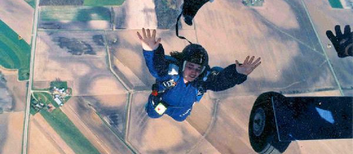

## Solo skydiving in Wisconsin &mdash; Instructor Assisted Deployment

__Instructor Assisted Deployment__ (IAD) is a __Solo__ training method that opens your parachute almost immediately upon leaving the aircraft _(about 3-4 seconds of freefall)_. You are never attached to the plane _(unlike static-line)_ and the deployment sequence is identical to the way experienced skydivers open their own parachutes. This thrilling, solo, __'do it by yourself'__ method is also a way to train to [become a licensed skydiver](../learn-to-skydive). Well over half of our students choose the IAD jump, __even if they want to only jump once__.

Classes are held on various Saturdays (reservations required), __late-April__ through __early-October__. The class starts at __8 a.m.__, __rain or shine__. You'll be jumping in the afternoon _(from 4000 feet!)_, weather permitting, so __plan on spending the whole day__. Radio contact assists you in landing your parachute safely _(about 4-6 minute canopy ride)_. GoPro video footage of your exit is available for purchase so that you can remember your jump for years to come. Train and jump on the same day.

### Requirements

  * At least __18__ years old
  * __Want to have fun__
  * Be in good health
  * IAD weight limit is __220 pounds__.
  * Please __refrain from alcohol__ for at least 12 hours before the course.
  * Wear __comfortable clothing and sneakers__.
  * You must bring a __valid government issued ID__ (Drivers License, State ID, passport).
  * A __$100 deposit__ is required to reserve your spot in a class or an appointment.

### Pricing

Solo skydives start at ~~$150~~ __$125 (Spring Special!)__ for your first jump and training. You can purchase video of your skydive exit for an additional __$30__.

Note: On sale due to our [Spring special](../specials).  price applies to classes taken in __May__ of this year.

We also offer gift certificates! 🎁

For more information, please see [our current prices](../prices#iad-pricing).

### FAQ

See [our dedicated FAQ](../frequently-asked-questions). For more, call us or shoot us an email.

### Videos

	

		<iframe width="640" height="360" src="https://www.youtube-nocookie.com/embed/gRG8zh7J0w0?rel=0&amp;showinfo=0" frameborder="0" allowfullscreen></iframe>
	

 

  <a href="../../book-now" class="button button--primary">Book your skydive now</a>

 
