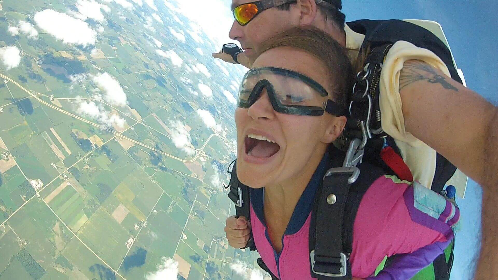

Jump from 10,000 feet attached to your instructor with a parachute built for two! Go along for the ride of your life! Tandem skydiving has made it easy to enjoy the exciting sport of skydiving with a fantastic introduction to the world of freefall. You will be harnessed to the front of a fully licensed, professional and friendly tandem instructor. Your instructor is in charge every step of the way, from aircraft exit, to freefall, (for about 30 seconds at 120 MPH!), to a scenic canopy ride (about 6-8 minutes), to a comfortable, accurate landing.

Classes are held most weekends, late-April through October. For more fun, you can purchase a video of your entire amazing jump taken by one of our aerial photographers - which includes pre- and post-jump interviews, the climb to altitude, and of course the exit and freefall and landing. This will all be recorded in HD so that you can remember your jump for years to come. About an hour of training. Train and jump on the same day. Appointment necessary.

### Requirements

  * 18 or over
  * Want to have fun
  * Be in good health
  * Tandem limits are 225 pounds.
  * Please refrain from alcohol for at least 12 hours before the course.
  * Wear comfortable clothing and sneakers.
  * You must bring a valid government issued ID (Drivers License, State ID, passport).
  * A non-refundable $100 deposit is required to reserve your spot in a class or an appointment.
  * Also, please bring your PATIENCE as we can not control the weather and other factors. Thanks.

### Pricing

See [our current prices](../prices#tandem-pricing).

### FAQ

See [our dedicated FAQ](../frequently-asked-questions). For more, call us or shoot us an email.

### Schedule

Call us any time at (608) 244-5252.